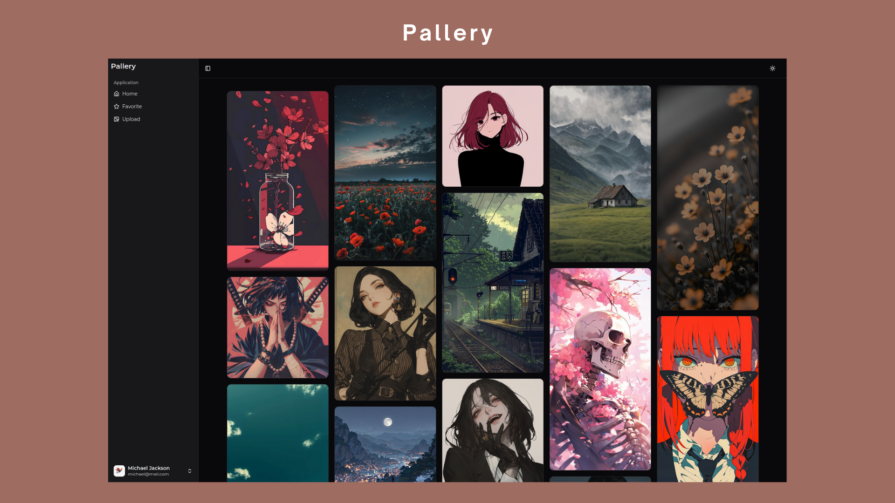

<div align="center">
    
</div>

# **Pallery**

**Your Personal Image Hosting!**

<div align="center">
    
</div>

### **1. Overview**

**Pallery** is a Pinterest-style web application for hosting images. 

Users can:

- Upload images to their personal gallery.
- Add images to favorite.
- View their images in a grid-based, responsive layout.
- Access their gallery after logging in.

---

### **2. File Structure**

```
/app                 # Frontend codebase
/server              # Backend codebase
/database            # Supabase database dump
    palery_db.sql    # SQL dump (public schema)
/docs                # Documentation
    app.md           # Frontend documentation
    server.md        # Backend documentation
    database.md      # Database documentation
/readme.md           # General project overview
```

---

### **3. Prerequisites**

- **Node.js**: [Install the latest LTS version.](https://nodejs.org/en)
- **Supabase Account**: [Create a Supabase project for database hosting.](https://supabase.com/)

---

### **4. Setup Instructions**

#### **Backend Setup**

1. Navigate to the `server` directory:
    
    ```bash
    cd server
    ```
    
2. Create a `.env` file based on the `example.env` provided:
    
    ```plaintext
    NODE_ENV=development # development or production
    
    SUPABASE_URL=https://your-project.supabase.co
    SUPABASE_SERVICE_ROLE_KEY=some-secret-key
    
    PORT=5000
    CLIENT_URL=http://localhost:5173
    
    JWT_SECRET=your-super-long-jwt-secret # Please use at least 32 characters
    ```
    
3. Install dependencies and run the server:
    
    ```bash
    npm install
    npm run dev
    ```
    

#### **Frontend Setup**

1. Navigate to the `app` directory:
    
    ```bash
    cd app
    ```
    
2. Update the configuration file at `app/src/config/config.ts`:
    
    ```typescript
    export const config = {
        SERVER_URL: "http://localhost:5000",
    }
    ```
    
    Adjust the `SERVER_URL` if the backend server runs on a different address or port.
3. Install dependencies and run the application:
    
    ```bash
    npm install
    npm run dev
    ```
    

#### **Database Setup**

1. Create a Supabase account and set up a new project.
2. Import the database schema from the dump file:
    - Open the Supabase project dashboard.
    - Navigate to **SQL Editor** → **New Query**.
    - Paste the content of `/database/pallery_db.sql` and execute.
3. Add the Supabase credentials to the `.env` file in the backend:
    - `SUPABASE_URL`
    - `SUPABASE_SERVICE_ROLE_KEY`

---

### **5. Running Pallery**

1. **Backend**: Start the backend server from `/server`:
    
    ```bash
    npm run dev
    ```
    
2. **Frontend**: Start the frontend from `/app`:
    
    ```bash
    npm run dev
    ```
    
3. Open your browser at [http://localhost:5173](http://localhost:5173).

---

### **6. Additional informations**

Frontend :  [app.md](./docs/app.md)

Server : [server.md](./docs/server.md)

Database : [database.md](./docs/database.md)

---

### 7. Contributing
We welcome contributions! Please see [CONTRIBUTING.md](./CONTRIBUTING.md) for guidelines.

---

### 8. License
This project is licensed under the [MIT License](./LICENSE).
